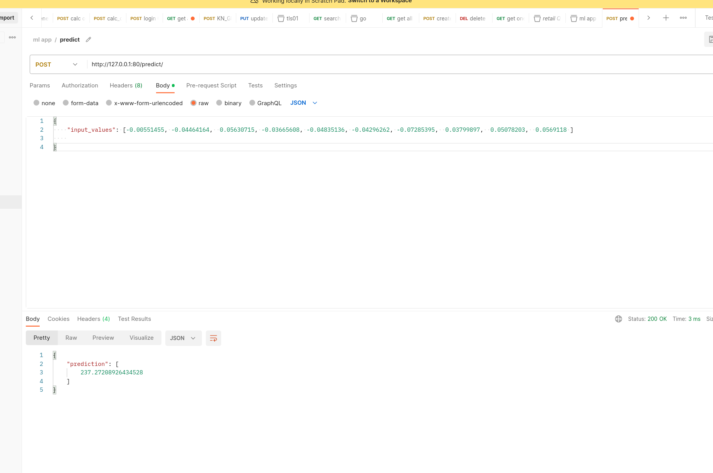

# MLOps Engineer Interview Project

### Spec

Data Scientist created a Jupyter notebook `diabetes.ipynb` that contains all the code to train, save, load and inference.
Your task is to create a REST API in python that serves the model and allows for online inference.
You should create 1 endpoint that accepts relevant input and returns the inference results to the client.

### How to share your results?
- [ ] Fork this repository and create your own branch to work on.
- [ ] Once you are ready, create a pull request with your code.

### How will the assessment take place?
- [x] Write at least one test.
- [x] Сode is clear and readable.
- [x] Build and push image with application to Docker Hub. darwin939/my-fastapi-app
- [x] No crashes or bugs.

### Suggestions to Make Your Project Stand Out!
- [ ] Use DVC or other solution for versioning models.
- [ ] Work towards pylint score of 10/10.
- [ ] Clear documentation of the API, you can use Swagger or any other format.
- [ ] Set Up CI/CD using Github Actions and Render Cloud or any other solution.

### How to run:

1. docker build -t my-fastapi-app .
2. docker run -d -p 80:80 my-fastapi-app

### How to test:
1. pytest -v

### How to use:
1. make post request to http://domain_name/predict/

### run from docker hub:
1. docker pull darwin939/my-fastapi-app
2. docker run -d -p 80:80 darwin939/my-fastapi-app